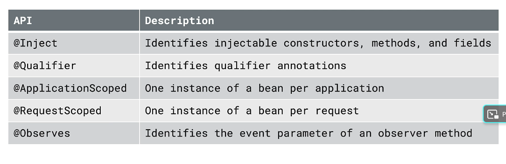
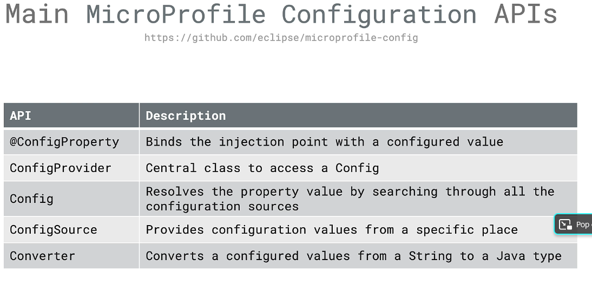
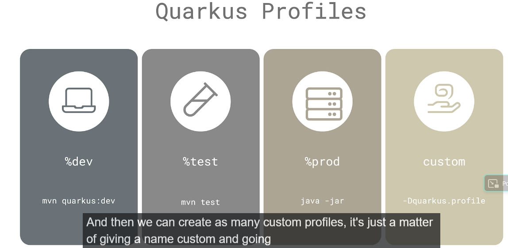
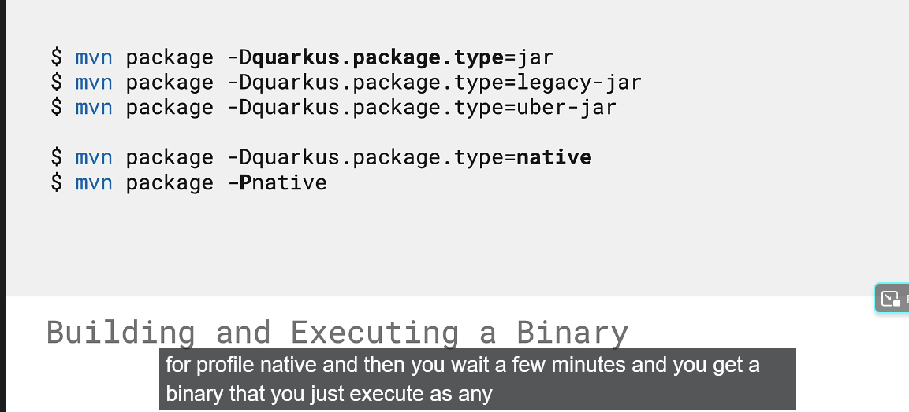

- Optional Class
  Optional is a container object which may or may not contain a non-null value. You must import java.util package to use this class. If a value is present, isPresent() will return true and get() will return the value. Additional methods that depend on the presence or absence of a contained value are provided, such as orElse() which returns a default value if the value is not present, and ifPresent() which executes a block of code if the value is present. This is a value-based class, i.e their instances are :

  Final and immutable (though may contain references to mutable objects).
  Considered equal solely based on equals(), not based on reference equality(==).
  Do not have accessible constructors. https://www.geeksforgeeks.org/java-8-optional-class/
- CDI :
  Context and Dependency Injection : Main CDI APis 

- quarkus-arc is the CDI implementation in Quarkus .  Quarkus internally uses a lot of CDI internally https://quarkus.io/blog/quarkus-dependency-injection/ 
- Quarkus includes a logger by default , org.jboss.logging 

- Microprofile Configuration apis 

- Profiles 
- 

- Types of packaging 
- 
@NativeImageTest for test cases agaisnt the binary 
- failsafe plugin is used to do the integration test
